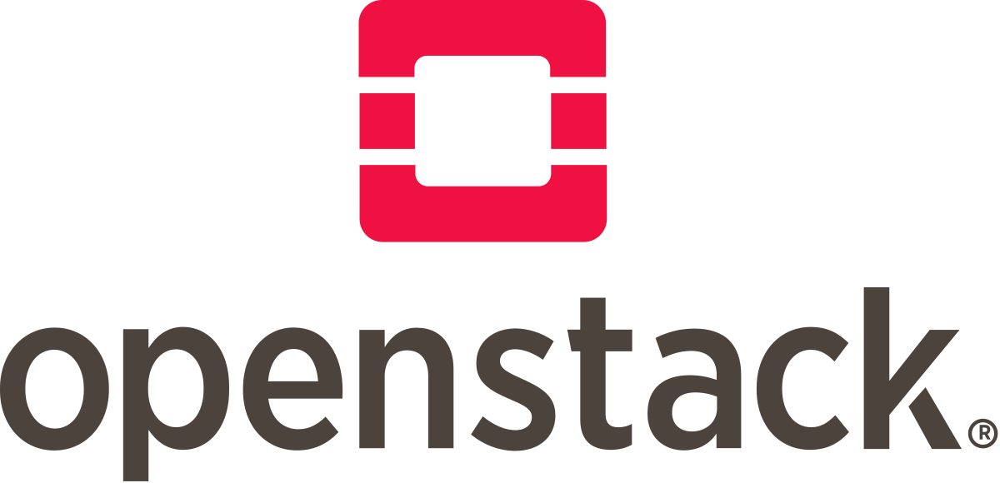

# Distributions available in our openstack **cloud.eodc.eu**:

### RedHat Enterprise Linux (RHEL) based:
- Rocky Linux 8

### Debian based:
- Debian 11
- Ubuntu22.04LTS

## Distributions available in our openstack **launcher.eodc.eu**:

### RedHat Enterprise Linux (RHEL) based:
- Almalinux8
- CentOS7
- CentOS stream

### Debian based:
- Debian 10
- Ubuntu16.04 LTS
- Ubuntu18.04 LTS
- Ubuntu20.04 LTS

## Usecases
In reality there is no good or bad distribution. Which distro one uses is mostly personal preference and familiarity.
The most notable difference would be the package manager which is
- `apt` for Debian based distros
- `dnf` for RHEL based distros

Another difference is the availability of packages through said package managers.
Debian has a lot of packages in it's main repositories while RHEL is rather limited though it can alway be expanded by adding new repositories like `epel release`.

Further the differences between Debian based distros like Debian and Ubuntu are even less. It mostly comes down to preinstalled packages.
Or like in the case of Ubuntu the proprietary package manager snap which is used in addition to apt.
The same applies to RHEL based distros like Almalinux or CentOS.

## Getting started
How to launch an instance can be found in our [old knowledgebase](https://support.eodc.eu/kb/faq.php?id=25). How to add a [SSH key](https://support.eodc.eu/kb/faq.php?id=27) and connect [via SSH](https://support.eodc.eu/kb/faq.php?id=2) is also covered there. 

**Important:**   
On cloud.eodc.eu the default user is  **eodc**.   
On launcher.eodc.eu it is the image name of the used distribution i.e. **ubuntu** or **centos**.
