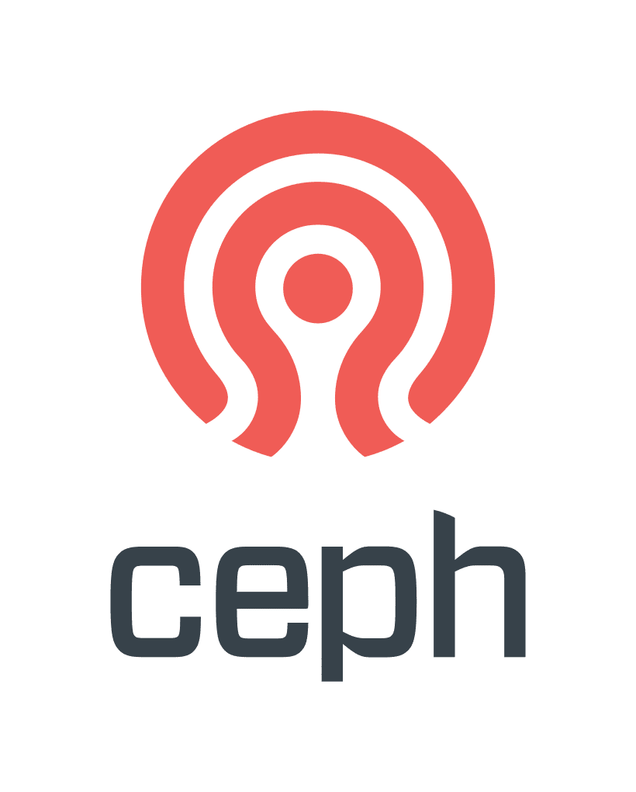

# Object storage @ EODC

## Overview

Object storage is available now at EODC. <br>
If you would like to get started with using object storage at EODC, or see a price list, contact [Support@eodc.eu](mailto:support@eodc.eu) <br>

Typically, our usage model is a per-project capacity limit, agreed in advance.
Currently, the number of buckets, objects within a bucket, and ingress/egress traffic, is subject only to generous fair usage policy.

Available interfaces:
 - SWIFT
 - S3

Endpoint:
`https://objectstore.eodc.eu:2222`


In our Cloud dashboard, be aware that some terminology may be different than you are familiar with.
For example, what is commonly referred to as a bucket is known as an container.
This is particularly relevant when using the openstack CLI interface.


## First Use
For basic storage usage, the cloud dashboard provides a comfortable way to:
- Create and destroy buckets
- Make an existing bucket public
- Create a metadata only object
- Upload a file into a bucket
- Manage folders within a bucket

Be aware all contents in a public bucket are accessible to anyone, anywhere.

## Access 
Access to the object storage requires your EODC Account.
This article assumes you already have a working and configured openstack client with access using Application Credentials.


### Generating EC2 Credentials
First let's generate EC2 credentials so we can use the S3 api as well as the SWIFT.

These credentials will grant full control over all buckets in your project. 
It is not possible to see any credentials generated by other users within your prject.

Be aware that if you are using object storage across multiple projects, multiple credentials are required.


```bash
source app-cred-user-openrc.sh
openstack ec2 credentials create
+------------+----------------------------------------------------------------------------------------------------------------------------------------------------------------------+
| Field      | Value                                                                                                                                                                |
+------------+----------------------------------------------------------------------------------------------------------------------------------------------------------------------+
| access     | 555b59fee5d3490db775dc0721ebed84                                                                                                                                     |
| links      | {'self': 'https://cloud.eodc.eu:5000/v3/users/1d07b2fabf9921acbeada0d8239fd8ce6f6d50e825eebf3d405903d2db48c017/credentials/OS-EC2/555b59fee5d3490db775dc0721ebed84'} |
| project_id | XXXXX                                                                                                                                     |
| secret     | ac49ee2e1ea1421683ecf6c37e9c9f82                                                                                                                                     |
| trust_id   | None                                                                                                                                                                 |
| user_id    | 1d07b2fabf9921acbeada0d8239fd8ce6f6d50e825eebf3d405903d2db48c017                                                                                                     |
+------------+----------------------------------------------------------------------------------------------------------------------------------------------------------------------+
```bash

Now there is an access key and a secret, these can be used with any S3 friendly tool. e.g. s3cmd, WinSCP, and S3FS.
Never share your secret with another user.

You can view these credentials again later.
```bash
openstack ec2 credentials list
+----------------------------------+----------------------------------+----------------------------------+------------------------------------------------------------------+
| Access                           | Secret                           | Project ID                       | User ID                                                          |
+----------------------------------+----------------------------------+----------------------------------+------------------------------------------------------------------+
| 555b59fee5d3490db775dc0721ebed84 | ac49ee2e1ea1421683ecf6c37e9c9f82 | XXXX                             | 1d07b2fabf9921acbeada0d8239fd8ce6f6d50e825eebf3d405903d2db48c017 |
+----------------------------------+----------------------------------+----------------------------------+------------------------------------------------------------------+
```

These can also be removed later, e.g. if they are compromised.

```bash
openstack ec credentials delete 555b59fee5d3490db775dc0721ebed84
```