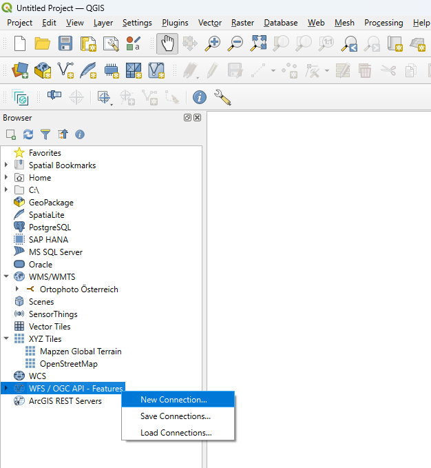
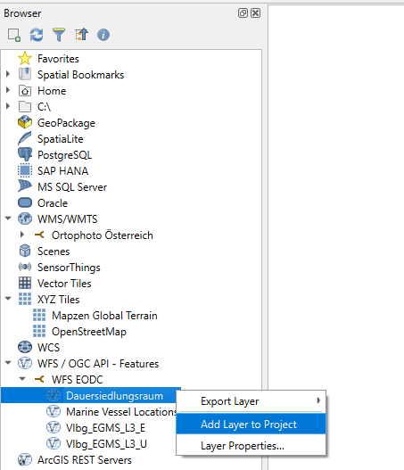

# Using EGMS as Web Feature Services (WFS)

## Overview 

### Web Feature Service (WFS)

Web Feature Services (WFS) are another way of providing access to geodata. In contrast to Web Map Services (WMS), WFS only returns objects with geometry and attributes and not entire images. WFS objects can also be limited by a spatial extent or by attributes.


### Ground Motion Service

Detecting ground and mass movements requires continuous monitoring and evaluation of current as well as historical data.
In this service, advanced differential SAR interferometry (DInSAR) techniques are applied to Sentinel-1 radar satellite imagery to derive ground and mass movements.

The service processes data from the European Ground Motion Service [EGMS](https://egms.land.copernicus.eu/) on the one hand, and the Subsidence and Landslide Monitoring Service Austria [SuLaMoSA](https://sims.sen2cube.at), prototype developed in ASAP-14, on the other hand.
Both services provide time series of east-west displacement and high-low movement for evaluable points, i.e. points that do not significantly change their radar backscatter properties over time. The spatial resolution for EGMS is ~100x100 m² and is currently available for the period 2016-2020. For SuLaMoSA, the parameters of spatial and temporal coverage can be freely selected.


## Use cases

### WFS in QGIS

WFS data can be displayed and analyzed with the help of a geographic information system (GIS). The most popular GIS is QGIS and in [this article](https://interface.eodc.eu/de/interface-massgeschneiderte-services-nutzen.html) is described, how to install it.

Once QGIS has been successfully installed and opened, you can search for WFS/OGC API features on the left-hand side in the browser. A new WFS connection can be added here with a `right click -> new Connection`.


A new window opens. A name for the layer can be entered here. To access the WFS of the EODC, https://features.services.eodc.eu/ must be entered as the URL. Click 'OK' to add the new connection. 

The new connection is now visible under WFS/OGC API - Features. The desired layer can be added to the project via drag and drop in the map field or `Right-click -> Add Layer to Project`.



### WFS in Jupyter

Since WFS are usually used for larger data sets, QGIS is not always optimal.
It is then helpful to load the data into a Jupyter notebook and display it there. With the help of various Python libraries, the data can be processed there in the same way as in a GIS. In addition, there are even more possibilities, e.g. to create diagrams.
 
The Jupyter notebook used in the following can be downloaded [here](https://github.com/eodcgmbh/eodc-examples/blob/main/tutorials/Ground_Motion_WFS.ipynb) from the EODC Github.
If the link does not work, it can be opened via <https://github.com/eodcgmbh> `-> eodc-examples -> tutorials -> Ground_Motion_WFS.ipynb`.


<br>
**Libraries used** <br>

- os: To use operating system-dependent functions
- geopandas: Easier processing of geodata
- contextily: To retrieve maps from the Internet (e.g. OSM)
- owslib.ogcapi.features: This can be used to read the WFS layer
- rich.console: Can be used to write beautifully formatted texts in the console (not relevant)
- numpy: Library for mathematical functions and multidimensional arrays
- matplotlib: Library for creating static, animated and interactive visualizations
- datetime: For displaying and changing dates and times
- matplotlib.dates: This can be used to adapt data and time to matplotlib

<br>
**Load the WFS** <br>

```
EODC_OGCAPI_URL = 'https://features.services.eodc.eu/'
eodc_ogcapi = Features(EODC_OGCAPI_URL)

feature_collections = eodc_ogcapi.feature_collections()
console.print(feature_collections)
```
Here, the URL of the WFS is read in first and a features object of the WFS is created with the help of the owslib.ogcapi.features library. From this, the various layers are loaded into the feature_collection and output.

Output: *'adriatic_vessels', 'Vlbg_EGMS_L3_E', 'Vlbg_EGMS_L3_U', 'STATISTIK_AUSTRIA_DSR'*

<br>
**Filter data according to desired extent** <br>

```
bbox = [9.7549833,47.4537861,9.7616428,47.4581097]

field_items = eodc_ogcapi.collection_items(
    "Vlbg_EGMS_L3_U",
    bbox = bbox,
    limit = 2000,
)

df = gpd.GeoDataFrame.from_features(field_items["features"], crs="EPSG:4326")
```

A bounding box, a rectangle with a specified spatial extent, is created and all objects from the feature Vlbg_EGMS_L3_U (ground movement high/low) that lie within the bounding box are selected. A geodata frame is then generated from these objects.

<br>
**sort the data** <br>

```
df_sorted = df[sorted(df.columns)]
df_sorted.head()
```
The dataframe is sorted according to the columns (alphabetically) and the first five rows are printed.

<br>
**Displaying the data on a map** <br>

```
ax = df[["geometry"]].plot(
    facecolor="red", figsize=(12, 6)
)
cx.add_basemap(ax, crs=df.crs.to_string(), source=cx.providers.OpenStreetMap.Mapnik);
```

The objects loaded in the geodata frame are displayed here in a map. OpenStreetMap was selected as the background map.

<br>
**Adaptation of the dataframe to NumPy** <br>

```
df_np = df_sorted.to_numpy()
columns_names=list(df_sorted)
acquisition_dates = columns_names[0:363]

acquisition_date_str = [f"{d[:4]}-{d[4:6]}-{d[6:8]}" for d in acquisition_dates]
acquisition_date_num = [datetime.strptime(d, "%Y-%m-%d") for d in acquisition_date_str]
```

A NumPy array is created from the dataframe with to_numpy. The names of the first 364 columns, which are the dates of the respective recording, are saved in acquisition_dates. The column names are then converted into a date format.

<br>
**Creating the diagram** <br>

```
fig_EGMS_timeseries, axes = plt.subplots(nrows=1, ncols=1,facecolor='white', figsize=[10, 5])

for i in range(len(df_np)):
    axes.plot(acquisition_date_num,df_np[i,0:363], ".-", markerfacecolor="w")

axes.xaxis.set_major_locator(mdates.MonthLocator(interval=6))
axes.xaxis.set_major_formatter(mdates.DateFormatter("%b %Y"))
plt.setp(axes.get_xticklabels(), rotation=30, ha="right")
axes.set_xlabel('Date')
axes.set_ylabel('EGMS up/down [cm]')
axes.grid(visible=True,axis='y')
```

This creates a diagram that shows the up/down movement of the individual objects/points over time. Each point is displayed in a different color and the format of the date on the x-axis is adjusted again.


