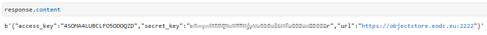
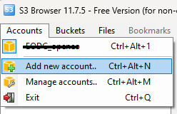
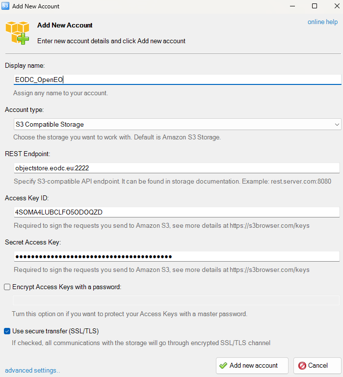
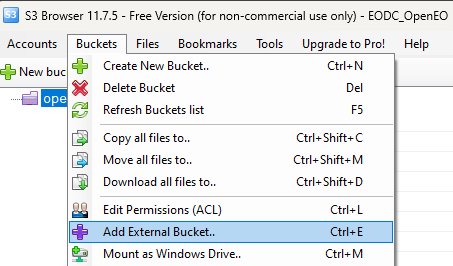
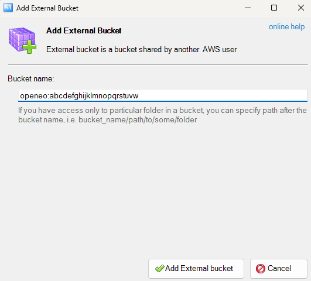

# User workspaces

## Overview 

Another option for saving openeo results are so-called user workspaces. The following describes how to set up a user workspace and how to save your data in it.
You can find example notebooks in the [eodc-examples github](https://github.com/eodcgmbh/eodc-examples/tree/main/demos/workspaces).


## 1. Setting up the user workspace in python

To set up the user worksapces in python, you need to install the [openeo](https://pypi.org/project/openeo/) and [eodc](https://pypi.org/project/eodc/) libraries first. Then we can connect to the openEO backend and authenticate with EGI Check-In.
```
import openeo

connection = openeo.connect("https://openeo-dev.eodc.eu/openeo/1.1.0")
connection = connection.authenticate_oidc(provider_id="egi")
```

If the connection was successful, we can create the bucket. To do this, we need to give it a unique name.

```
import requests

WORKSPACE_NAME = "abcdefghijklmnopqrstuvw"

response = requests.post(
    url=f"https://openeo-dev.eodc.eu/openeo/1.1.0/workspace/{WORKSPACE_NAME}",
    headers={
        "authorization": f"Bearer {connection.auth.bearer}"
    },
)
```

To be able to access the bucket, it needs an access and secret key. To be able to access the bucket, it needs an access and secret key. We can generate these with `response.content`. You need to save the keys in order to work with your workspace.




## 2. Setting up the user workspace in S3 Browser

To access and manage files in your bucket you can use a [S3 Browser](https://s3browser.com/).
Before you can start with the S3 Browser you have to follow the steps described in 1.

First you need to create a new account.



It is important that the account type is 'S3 Compatible Storage'. The endpoint, access and secret access key are taken from above.



To then link the bucket, a new bucket must be created with `Bucket -> Add external bucket`.



The name must match the name specified in python, except that `openeo:` must be written in front of it. After the bucket has been created, it can be used like a normal file directory.




## 3. Writing data into your workspace

To save results from openEO jobs to workspaces you need to add the workspace option to the arguments of the save_result node with your workspace name and your files will be saved directly to the workspace.

```
import openeo

# Set This variable to your workspace's name.

WORKSPACE_NAME = 'abcdefghijklmnopqrstuvw'

# Connect to the openEO backend and authenticate with EGI Check-In

connection = openeo.connect("https://openeo.eodc.eu/openeo/1.1.0")
connection = connection.authenticate_oidc(provider_id="egi")
```

Here we call save result giving it the "workspace" option which we set to our desired workspace name. Then we can start the job.
```
result = collection.save_result(options=options)

job = result.create_job()
job.start_job()
```

To check our results, we need an adapter. Then we can see all our results listed. The collection id corresponds to the created folder name. The STAC collection data is found in the STAC folder, and the created files are in the first level of the folder, while the STAC items are found in the ../STAC/items/

```
from eodc.workspace import WorkspaceAdapter, CephAdapter 

adapter = CephAdapter(S3_ENDPOINT, SecretStr(S3_ACCESS_KEY),  SecretStr(S3_SECRET_KEY))
adapter.list_workspace_files(WORKSPACE_NAME)
```

## 4. Loading data from your workspace

You can also load data from your workspace into your project.

First you need to connect to openeo.

```
import openeo

# Connect to the openEO backend and authenticate with EGI Check-In

connection = openeo.connect("https://openeo.eodc.eu/openeo/1.1.0")
connection = connection.authenticate_oidc(provider_id="egi")
```

Then you can connect to your workspace. Fill in your Workspace name, access and secret key. In order to load a user collection, we have to first find out the collection id, we can do this by listing the stac collections within the workspace using the list_stac_collections(WORKSPACE_NAME) function. This function returns us a list of tuples consisting of the collection_id and the path to the stac collection json. 
You can either set your collection id manually or set it via the list_stac_collections return value.

```
from eodc.workspace import CephAdapter, EODC_CEPH_URL

# Set these variables to your own.

WORKSPACE_NAME = ""

S3_ENDPOINT = EODC_CEPH_URL
S3_ACCESS_KEY = ""
S3_SECRET_KEY = ""

adapter: CephAdapter = CephAdapter(S3_ENDPOINT, S3_ACCESS_KEY, S3_SECRET_KEY)

collections = adapter.list_stac_collections(WORKSPACE_NAME)

# collection_id = ""

collection_id = collections[0][0]
```


You can also check the available STAC items of your given collection beforehand by using the get_stac_items function of the workspace adapter.

```
items = adapter.get_stac_items(workspace_name=WORKSPACE_NAME, collection_id=collection_id)

items
```

Now we can start a job with the corresponding collection_id in the load_collection node, with the workspace property filled out.

```
import uuid

process_graph = {
    "id": str(uuid.uuid4()),
    "process_graph": {
        "load1": {
            "process_id": "load_collection",
            "arguments": {
                "id": collection_id,
                "properties": {"workspace": WORKSPACE_NAME},
                "spatial_extent": {
                    "west": 15,
                    "east": 48,
                    "south": 17,
                    "north": 49,  
                },
                "temporal_extent": [
                    "2019-01-01T00:00:00Z",
                    "2024-01-08T00:00:00Z",
                ],
                "bands": ["raster-result"],
            },
        },
        "save2": {
            "process_id": "save_result",
            "arguments": {"data": {"from_node": "load1"}, "format": "GTIFF"},
            "result": True,
        },
    },
}


job = connection.create_job(process_graph=process_graph, title="load-from-workspace-job")
job.start_job()
```

## 5. Share your workspace

You can easily give other users read-access to your (EODC)-Workspace by sending a post request to the /workspace/{workspace_name}/share/{user_id}" endpoint, which will then give read-access to the given user.

```
SHAREE_USER_ID = ""

import requests

response = requests.post(
    url=f"https://openeo.eodc.eu/openeo/1.1.0/workspace/{WORKSPACE_NAME}/share/{SHAREE_USER_ID}",
    headers={
        "authorization": f"Bearer {connection.auth.bearer}"
    },
)

response.content
```
